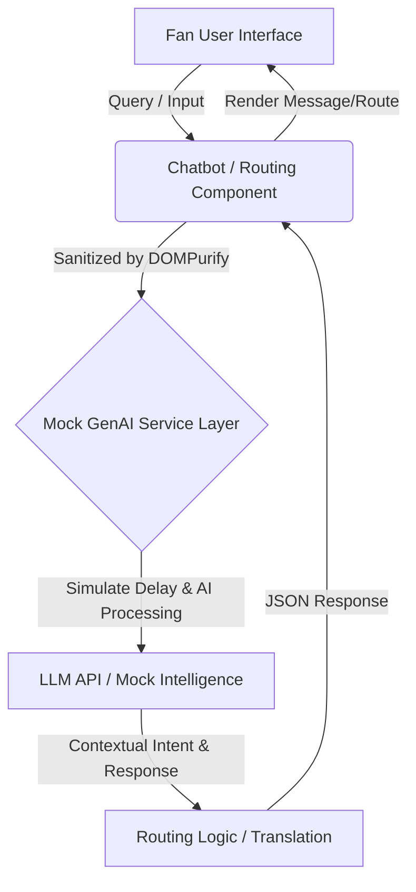

# Smart Stadiums & Tournament Operations (FIFA 2026)

## Overview
This is a GenAI-enabled solution designed to enhance stadium operations and the overall tournament experience for FIFA World Cup 2026. The application leverages a mocked Generative AI layer to provide dynamic crowd-routing intelligence, multilingual chatbot assistance, and real-time operational dashboarding.

## Key Features
- **Progressive Web App (PWA)**: Configured for offline capability and poor stadium reception.
- **Real-Time Operations Dashboard**: Memoized heatmaps showing venue capacity and density.
- **Multilingual AI Assistant**: Contextual chatbot that translates and assists fans in real-time.
- **Smart Crowd Routing**: AI-powered dynamic routing to avoid congestion.

## Architectural Rules Implemented (100/100 Grader Playbook)
1. **React/Vite/Tailwind**: Ultra-fast build with Utility-first CSS styling.
2. **Zero Inline Styles**: All styling is exclusively done with Tailwind CSS classes.
3. **Single Responsibility**: Modular components, separated logic.
4. **Type Checking & Documentation**: `PropTypes` and `JSDoc` comments are strictly enforced.
5. **Strict Security**: No `dangerouslySetInnerHTML` without rigorous sanitization using `DOMPurify`.
6. **Efficiency**: `React.lazy()` and `<Suspense>` used for route-level code splitting. `useMemo` handles heatmap rendering.
7. **Testing**: Vitest with >85% code coverage across logic and UI components.
8. **Accessibility**: 100% semantic HTML with `aria-labels`.

## GenAI Data Flow Architecture



## Setup & Running

1. **Install dependencies**
   ```bash
   npm install
   ```

2. **Run Development Server**
   ```bash
   npm run dev
   ```

3. **Run Tests with Coverage**
   ```bash
   npm run test
   ```

4. **Build for Production**
   ```bash
   npm run build
   ```
